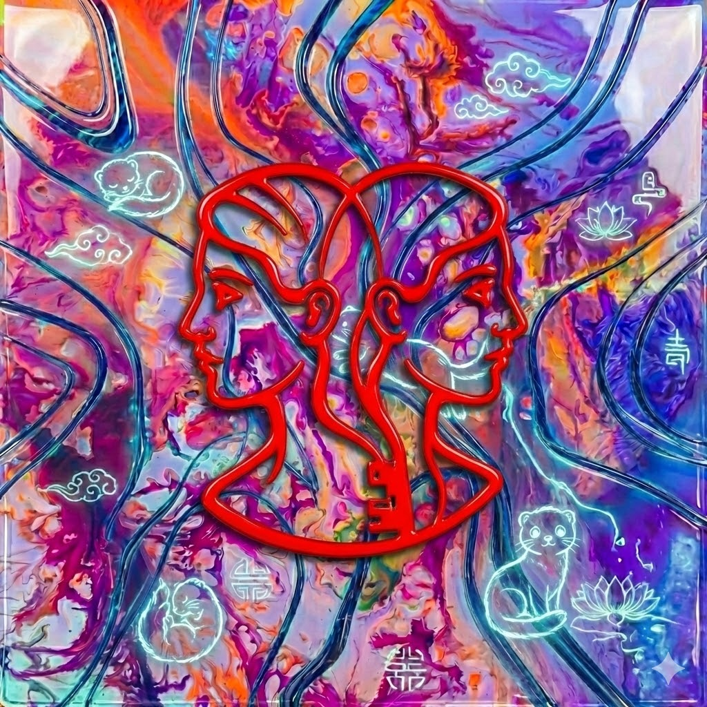

<p align="center">
  
</p>

# Janus

Android companion app for the llizard CarThing UI system. Bridges Android media playback to the Spotify CarThing device via Bluetooth Low Energy (BLE).

## Overview

Janus acts as a BLE GATT server that exposes media playback state, album art, and podcast browsing to [Mercury](https://github.com/pautown/mercury), the BLE client daemon running on the CarThing. It monitors the Android device's active media sessions (Spotify, YouTube Music, etc.) and makes that state available over BLE, while also providing a built-in podcast player with lazy-loading episode browsing.

**Architecture**: Android Phone (Janus/GATT Server) ← BLE → CarThing (Mercury/GATT Client) → Redis → [llizard](https://github.com/pautown/llizard)

## System Overview

Janus is part of a three-component system for bringing media control to the Spotify CarThing:

| Component | Platform | Role |
|-----------|----------|------|
| **Janus** | Android | BLE GATT server exposing media state from phone |
| [**Mercury**](https://github.com/pautown/mercury) | CarThing (Go) | BLE client daemon that bridges phone ↔ Redis |
| [**llizard**](https://github.com/pautown/llizard) | CarThing (C/raylib) | Native GUI that displays media from Redis |

## Features

- **BLE GATT Server**: Advertises and serves media state over BLE
- **Universal Media Control**: Monitors any Android media app via MediaSessionCompat
- **Podcast Player**: Built-in podcast player with subscription management
- **Podcast Browsing**: Lazy-loading podcast browser with A-Z list, recent episodes, and per-podcast episode lists
- **Album Art Transfer**: Optimized binary chunked transfer protocol
- **Compact BLE Format**: ~55% reduction in payload size for podcast data
- **Lyrics Fetching**: Multi-source synced lyrics (LRCLIB, NetEase)
- **Playback Commands**: Bidirectional control (play, pause, seek, volume, skip)
- **Foreground Service**: Maintains BLE connection in background

## Requirements

- **Android 8.0+** (API level 26)
- **BLE Hardware** (Bluetooth Low Energy)
- **Notification Listener Permission** (for universal media monitoring)
- **Storage Permission** (for podcast caching)

## Build Instructions

### Prerequisites

- Android Studio Hedgehog (2023.1.1) or later
- JDK 17
- Android SDK 34
- Kotlin 1.9.22

### Building

1. Clone the repository:
```bash
git clone https://github.com/pautown/janus-android.git
cd janus-android
```

2. Open in Android Studio or build via command line:
```bash
./gradlew assembleDebug
```

3. Install to device:
```bash
./gradlew installDebug
```

Or build release APK:
```bash
./gradlew assembleRelease
# APK output: app/build/outputs/apk/release/app-release-unsigned.apk
```

## Architecture

### Layer Structure

```
┌─────────────────────────────────────────────────────────┐
│                    UI Layer (Compose)                   │
│  MainActivity, MainViewModel, PodcastPage, PlayerPage   │
└─────────────────────────────────────────────────────────┘
                           ↓
┌─────────────────────────────────────────────────────────┐
│                    Domain Layer                         │
│  MediaState, PlaybackCommand, CompactBleModels          │
│  PodcastInfoResponse, PodcastListResponse               │
└─────────────────────────────────────────────────────────┘
                           ↓
┌─────────────────────────────────────────────────────────┐
│                    Data Layer                           │
│  MediaRepository, PodcastRepository                     │
│  MediaSessionListener, PodcastPlayerService             │
│  Room Database (podcasts, episodes)                     │
└─────────────────────────────────────────────────────────┘
                           ↓
┌─────────────────────────────────────────────────────────┐
│                    BLE Layer                            │
│  GattServerService, GattServerManager                   │
│  AlbumArtTransmitter, NotificationThrottler             │
└─────────────────────────────────────────────────────────┘
```

### Key Components

#### BLE Layer
- **GattServerService**: Foreground service hosting the BLE GATT server
- **GattServerManager**: Manages BLE lifecycle, advertising, and characteristic operations
- **AlbumArtTransmitter**: Handles chunked album art transmission
- **NotificationThrottler**: Rate-limits BLE notifications to prevent overflow

#### Data Layer
- **MediaRepository**: Provides current media state and album art
- **MediaSessionListener**: NotificationListenerService that monitors Android media sessions
- **PodcastRepository**: Manages podcast subscriptions and episodes (Room database)
- **PodcastPlayerService**: Media3-based podcast player with MediaSession support
- **LyricsApiService**: Fetches synced lyrics from LRCLIB and NetEase

#### Domain Layer
- **MediaState**: Current playback state (track, artist, position, volume)
- **PlaybackCommand**: Commands from CarThing (play, pause, seek, volume, podcast browsing)
- **CompactBleModels**: Optimized data models for BLE transfer

## BLE Protocol

### Service UUID
```
0000a0d0-0000-1000-8000-00805f9b34fb  (Janus Service)
```

### Characteristics

| Characteristic | UUID | Properties | Description |
|----------------|------|------------|-------------|
| Media State | `0000a0d1-...` | Read, Notify | Current media playback state (JSON) |
| Playback Control | `0000a0d2-...` | Write | Commands from CarThing (JSON) |
| Album Art Request | `0000a0d3-...` | Write | Request album art by hash (JSON) |
| Album Art Data | `0000a0d4-...` | Read, Notify | Album art chunks (binary) |
| Podcast Info | `0000a0d5-...` | Read, Notify | Podcast data (JSON, chunked) |
| Lyrics Request | `0000a0d6-...` | Write | Request lyrics for track |
| Lyrics Data | `0000a0d7-...` | Read, Notify | Synced lyrics (JSON, chunked) |
| Settings | `0000a0d8-...` | Read, Write | Configuration settings |

### Media State Characteristic

JSON structure sent to CarThing on media changes:

```json
{
  "isPlaying": true,
  "playbackState": "playing",
  "trackTitle": "Song Title",
  "artist": "Artist Name",
  "album": "Album Name",
  "duration": 240000,
  "position": 45000,
  "volume": 75,
  "albumArtHash": "1234567890"
}
```

### Playback Control Characteristic

Commands sent from CarThing:

```json
{"action": "play"}
{"action": "pause"}
{"action": "toggle"}
{"action": "next"}
{"action": "previous"}
{"action": "seek", "value": 60000}
{"action": "volume", "value": 80}
{"action": "play_podcast_episode", "podcastId": "abc123", "episodeIndex": 5}
{"action": "request_podcast_list"}
{"action": "request_recent_episodes", "limit": 30}
{"action": "request_podcast_episodes", "podcastId": "abc123", "offset": 0, "limit": 15}
```

### Album Art Transfer Protocol

**Binary chunk format** (512 bytes total):

```
[0-3]   Magic bytes: 0xAA 0xBB 0xCC 0xDD
[4-7]   CRC32 hash (big-endian)
[8-9]   Chunk index (big-endian uint16)
[10-11] Total chunks (big-endian uint16)
[12-15] Data length (big-endian uint32)
[16-511] Raw WebP image data (496 bytes max)
```

- Album art resized to 250x250px, WebP format, quality 75
- Chunks sent at 10ms intervals with ACK flow control
- CarThing requests art by CRC32 hash to avoid redundant transfers

### Podcast Info Characteristic

Three response types for lazy-loading podcast browsing:

#### Type 1: Podcast List (A-Z)

Header: `[0x01][chunk_index][total_chunks]` + JSON payload

```json
{
  "p": [
    {"h": "abc12345", "n": "Podcast Name", "c": 150}
  ],
  "np": {"h": "abc12345", "t": "Episode Title", "i": 5}
}
```

#### Type 2: Recent Episodes

Header: `[0x02][chunk_index][total_chunks]` + JSON payload

```json
{
  "e": [
    {"h": "a1b2c3d4", "c": "Podcast Name", "t": "Episode Title", "d": 3600, "i": 0}
  ],
  "t": 30
}
```

#### Type 3: Podcast Episodes (Paginated)

Header: `[0x03][chunk_index][total_chunks]` + JSON payload

```json
{
  "h": "abc12345",
  "n": "Podcast Name",
  "t": 150,
  "o": 0,
  "m": true,
  "e": [
    {"h": "a1b2c3d4", "t": "Episode Title", "d": 3600}
  ]
}
```

## Compact BLE Format

To minimize BLE bandwidth usage, podcast data uses a compact JSON format with abbreviated field names and optimized data types.

### Size Reduction Example

**Original Format** (~180 bytes per episode):
```json
{
  "podcastId": "com.example.podcast.feed.123",
  "podcastTitle": "The Example Podcast Show",
  "title": "Episode 42: Understanding the Universe",
  "duration": 3600000,
  "publishDate": "Jan 15, 2024",
  "pubDate": 1705305600000,
  "episodeIndex": 0
}
```

**Compact Format** (~80 bytes per episode, **55% smaller**):
```json
{
  "h": "a1b2c3d4",
  "c": "The Example Podcast Show",
  "t": "Episode 42: Understanding the Universe",
  "d": 3600,
  "i": 0
}
```

### Field Mappings

| Original | Compact | Notes |
|----------|---------|-------|
| `podcastId` + `pubDate` | `h` | CRC32 hash (8 chars) |
| `podcastTitle` | `c` | Channel name |
| `title` | `t` | Episode title |
| `duration` | `d` | Seconds (not ms) |
| `episodeIndex` | `i` | Index for playback |
| `podcastHash` | `h` | Podcast ID hash |
| `name` | `n` | Podcast name |
| `count` | `c` | Episode count |
| `total` | `t` | Total count |
| `offset` | `o` | Pagination offset |
| `more` | `m` | Has more pages |
| `episodes` | `e` | Episode array |
| `podcasts` | `p` | Podcast array |
| `nowPlaying` | `np` | Currently playing |

### Hash Generation

Episode hash encodes `podcastId|pubDate` as CRC32:
```kotlin
fun generateEpisodeHash(podcastId: String, pubDate: Long): String {
    val input = "$podcastId|$pubDate"
    val crc = CRC32()
    crc.update(input.toByteArray())
    return String.format("%08x", crc.value)  // "a1b2c3d4"
}
```

## Podcast Lazy Loading System

### Three-Layer Browse Experience

1. **A-Z Podcast List** (Type 1 Response)
   - Shows all subscribed podcasts sorted alphabetically
   - Displays: podcast name, episode count
   - No episodes loaded initially → minimal bandwidth

2. **Recent Episodes** (Type 2 Response)
   - Cross-podcast chronological feed
   - Displays: podcast name, episode title, duration
   - Limited to N most recent episodes (default 30)

3. **Per-Podcast Episodes** (Type 3 Response)
   - Episodes for specific podcast, paginated
   - Displays: episode title, duration
   - Loads 15 episodes per page, on-demand

### Request Flow Example

```
CarThing (Mercury)                Janus (Android)
       │                                 │
       ├─ request_podcast_list ─────────>│
       │<─ Type 1: Podcast List ─────────┤
       │  (names only, no episodes)      │
       │                                 │
       ├─ request_podcast_episodes ─────>│
       │  podcastId="abc123"             │
       │  offset=0, limit=15             │
       │<─ Type 3: Episodes 0-14 ────────┤
       │                                 │
       ├─ request_podcast_episodes ─────>│
       │  podcastId="abc123"             │
       │  offset=15, limit=15            │
       │<─ Type 3: Episodes 15-29 ───────┤
```

### Bandwidth Savings

Traditional approach (send all episodes upfront):
- 10 podcasts × 100 episodes × 180 bytes = **180 KB**

Lazy loading approach (send list + on-demand episodes):
- 10 podcasts × 80 bytes = 800 bytes
- 1 podcast × 15 episodes × 80 bytes = 1.2 KB
- **Total: ~2 KB** (99% reduction for initial load)

## Usage

### First Launch

1. Grant **Bluetooth** permissions
2. Grant **Notification Listener** permission (Settings → Apps → Janus → Notification access)
3. Grant **Post Notifications** permission (Android 13+)
4. Tap **Start BLE Service** in the app

### Connecting to CarThing

1. Ensure [Mercury](https://github.com/pautown/mercury) daemon is running on CarThing
2. CarThing will auto-discover and connect to "Janus" BLE advertisement
3. Connection status shows in app UI

### Podcast Subscriptions

1. Navigate to **Podcasts** tab
2. Search for podcasts or add RSS feed URL
3. Tap **Subscribe** to add to library
4. Subscribed podcasts appear in **My Podcasts** section
5. Podcasts are automatically exposed to CarThing via BLE

### Media Playback

- Play media on **any Android app** (Spotify, YouTube Music, etc.)
- Media state automatically syncs to CarThing
- Control playback from CarThing UI
- Album art transfers on-demand when requested

## Dependencies

### Core
- Kotlin 1.9.22
- AndroidX Core KTX 1.12.0
- AndroidX Lifecycle 2.7.0
- Jetpack Compose (BOM 2024.12.01)

### Dependency Injection
- Hilt 2.50

### Networking
- Retrofit 2.9.0
- OkHttp 4.12.0
- Kotlinx Serialization 1.6.2

### Media
- Media3 (ExoPlayer) 1.2.1
- AndroidX Media 1.7.0

### Database
- Room 2.6.1

### Other
- RSS Parser 6.0.7
- Coil (image loading) 2.5.0

## Permissions

```xml
<!-- BLE -->
<uses-permission android:name="android.permission.BLUETOOTH" />
<uses-permission android:name="android.permission.BLUETOOTH_ADMIN" />
<uses-permission android:name="android.permission.BLUETOOTH_ADVERTISE" />
<uses-permission android:name="android.permission.BLUETOOTH_CONNECT" />

<!-- Media monitoring -->
<uses-permission android:name="android.permission.BIND_NOTIFICATION_LISTENER_SERVICE" />

<!-- Networking (podcast fetching, lyrics) -->
<uses-permission android:name="android.permission.INTERNET" />

<!-- Foreground service -->
<uses-permission android:name="android.permission.FOREGROUND_SERVICE" />
<uses-permission android:name="android.permission.FOREGROUND_SERVICE_CONNECTED_DEVICE" />
<uses-permission android:name="android.permission.FOREGROUND_SERVICE_MEDIA_PLAYBACK" />
<uses-permission android:name="android.permission.POST_NOTIFICATIONS" />
```

## Integration with Mercury

Janus is designed to work with [Mercury](https://github.com/pautown/mercury), the BLE client daemon on the CarThing. Mercury:

1. Scans for "Janus" BLE advertisement
2. Connects as GATT client
3. Subscribes to Media State, Album Art, and Lyrics characteristics
4. Sends playback commands via Playback Control characteristic
5. Requests podcast data via Podcast Info characteristic
6. Stores all state in Redis for consumption by [llizard](https://github.com/pautown/llizard) UI plugins

## Development Notes

### Testing BLE without CarThing

Use **nRF Connect** app on another Android device to inspect GATT characteristics:
1. Install nRF Connect for Mobile
2. Scan for "Janus" device
3. Connect and explore service `0000a0d0-...`
4. Read/subscribe to characteristics
5. Write commands to Playback Control characteristic

### Debugging

Enable verbose BLE logging:
```bash
adb shell setprop log.tag.GattServerManager VERBOSE
adb shell setprop log.tag.GattServerService VERBOSE
adb shell setprop log.tag.AlbumArtTransmitter VERBOSE
adb logcat -s GattServerManager:V GattServerService:V AlbumArtTransmitter:V PODCAST:I ALBUMART:I LYRICS:D
```

### Adding New Playback Commands

1. Add action constant to `PlaybackCommand.kt`
2. Add to `VALID_ACTIONS` set
3. Handle in `GattServerService.observeCommands()`
4. Implement in `ProcessPlaybackCommandUseCase.kt`

### Modifying BLE Protocol

**IMPORTANT**: BLE UUIDs and data formats must match [Mercury](https://github.com/pautown/mercury) exactly. Any changes require coordinated updates on both sides.

## Related Projects

- [**llizard**](https://github.com/pautown/llizard): Native CarThing GUI (raylib/raygui)
- [**Mercury**](https://github.com/pautown/mercury): CarThing BLE client daemon (bridges Janus ↔ Redis)

## License

See repository for license details.

---

**Note**: Janus requires a Spotify CarThing device running [llizard](https://github.com/pautown/llizard) with [Mercury](https://github.com/pautown/mercury). It will not function as a standalone media player without BLE connectivity to the CarThing.
